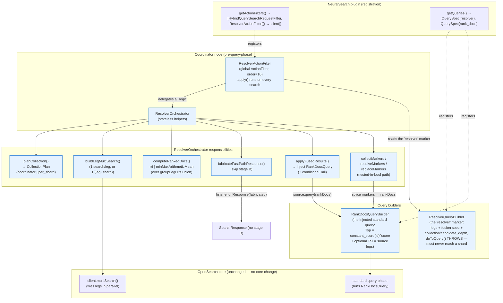
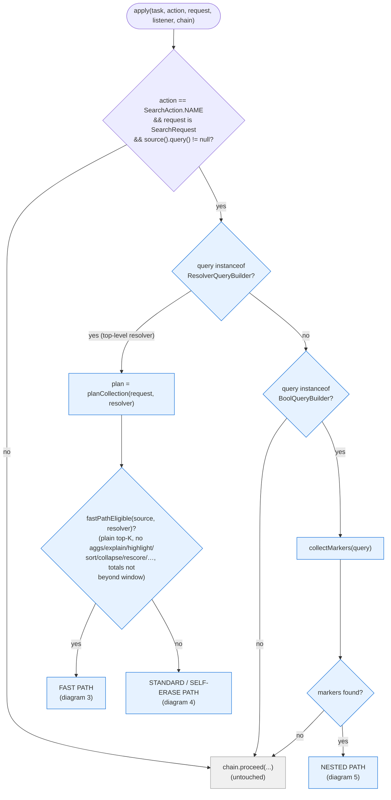
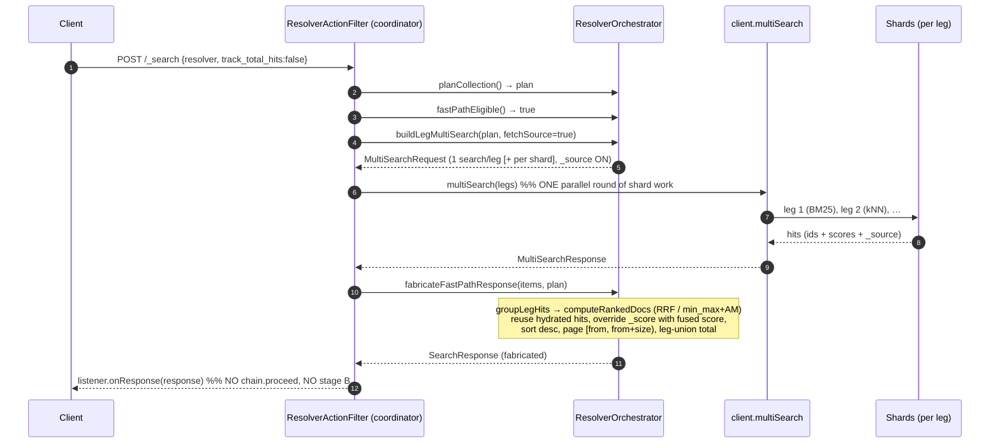
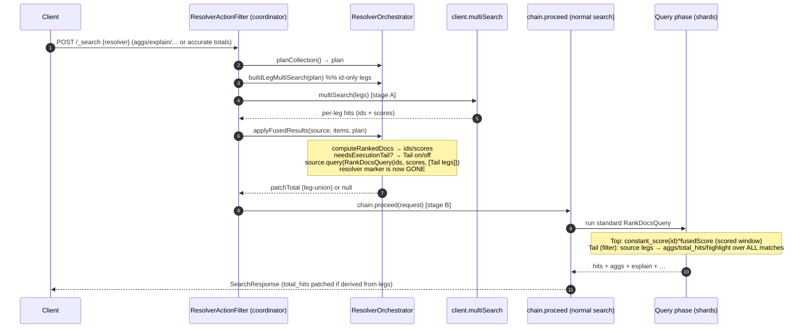
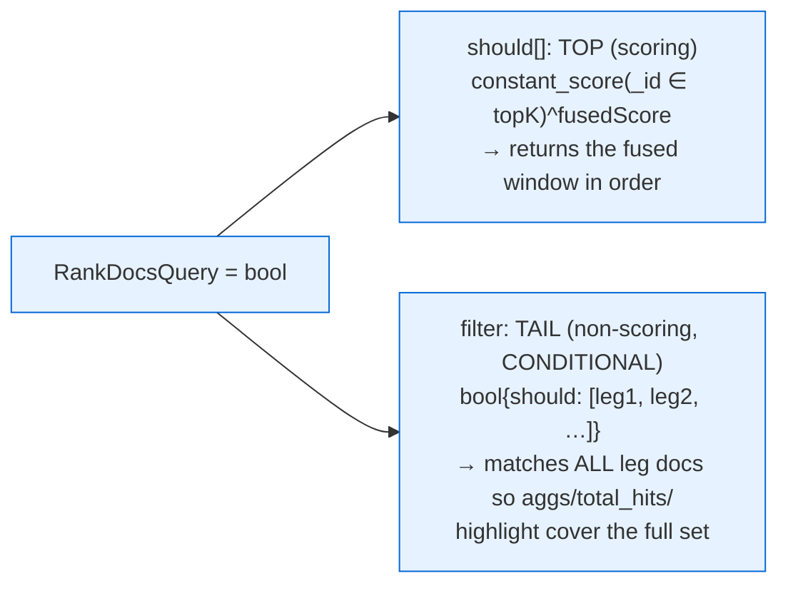
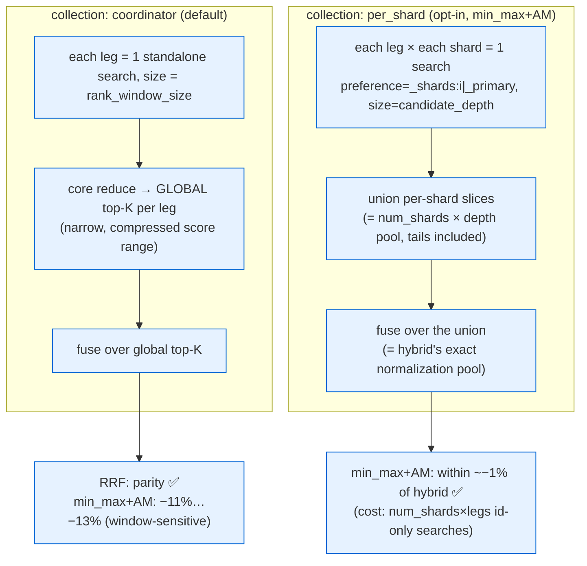

# Resolver POC — flow & component diagrams

Mermaid diagrams for the resolver approach (branch `poc/resolver-phase1`). Renders natively on GitHub. Companion to [`RESOLVER_POC.md`](RESOLVER_POC.md). Grounded in the actual code in `src/main/java/org/opensearch/neuralsearch/resolver/` — `ResolverQueryBuilder`, `ResolverActionFilter`, `ResolverOrchestrator`, `RankDocsQueryBuilder` — registered in `NeuralSearch.getActionFilters()` / `getQueries()`.

One-line model: **fire the legs as parallel searches on the coordinator BEFORE the query phase, fuse globally, then either fabricate the response directly (fast path) or self-erase into a standard `RankDocsQuery` that the ordinary search phase runs — so explain/aggs/highlight/nesting all work for free.**

---

## 1. Component diagram — the pieces and how they relate



**Key relationships**
- The **ActionFilter is the sole entry point** (pipeline-free). It's a *global* filter but does ~nothing for non-resolver queries (§6.7 / overhead note).
- `ResolverQueryBuilder` is a **marker only** — its `doToQuery()` throws, so it must be consumed on the coordinator and never reach a shard.
- All real logic lives in the **stateless `ResolverOrchestrator`**; the filter just routes.
- The output is always a **standard query** (`RankDocsQuery`) or a **fabricated response** — never a non-standard transport type (contrast hybrid's `CompoundTopDocs`). That's why nesting/features work.

---

## 2. Flow — `ResolverActionFilter.apply()` decision tree (every search)



The **non-resolver fall-through** (grey path) is the common case: a couple of `instanceof`/`equals` checks, and for a bool query one `collectMarkers` walk that finds nothing → `chain.proceed`. Measured ~5 ns for a leaf query (coordinator-only, once/request).

---

## 3. Flow — FAST PATH (plain top-K, beats hybrid latency)

Skips the second (stage-B) distributed search: the legs fetch `_source`, and the response is fabricated from the fused window.



**Why it's faster than hybrid:** exactly one round of shard work (the parallel legs), no second query+fetch pass. Measured 0.58–0.88× hybrid p50.

---

## 4. Flow — STANDARD / SELF-ERASE PATH (aggs / explain / accurate totals / …)

Two phases: coordinator orchestration rewrites the request into a standard `RankDocsQuery`, then the ordinary query phase runs it.



`RankDocsQuery` shape:



---

## 5. Flow — NESTED path (resolver inside a `bool`, ≥1 markers)

Hybrid cannot nest; the resolver can, because each marker self-erases into a standard `RankDocsQuery` spliced back into the tree.

```mermaid
sequenceDiagram
    autonumber
    participant AF as ResolverActionFilter
    participant O as ResolverOrchestrator
    participant MS as client.multiSearch
    participant CH as chain.proceed

    Note over AF: query is a bool tree containing resolver marker(s)
    AF->>O: collectMarkers(query)
    Note over O: recurse bool must/should/filter;<br/>accumulate enclosing filter clauses as push-down
    O-->>AF: List<MarkerContext> (marker + pushDownFilters)
    AF->>O: buildMarkerMultiSearch(markers)   %% all legs of all markers, filters pushed into each leg
    AF->>MS: multiSearch(all legs)
    MS-->>AF: per-marker leg hits
    AF->>O: resolveMarkers(markers, responses) → IdentityHashMap<marker, RankDocsQuery (Top-only)>
    AF->>O: replaceMarkers(query, resolved)  %% rebuild bool with each marker swapped
    O-->>AF: rewritten standard query tree
    AF->>CH: source.query(rewritten); chain.proceed
    Note over CH: ordinary search runs the standard bool tree
```

Scope: traversal is `bool`-only; **filter push-down** (enclosing `filter` clauses injected into each leg) is what makes nesting semantically correct (fuse over the filtered candidate set). Nested markers are Top-only (per-shard collection is top-level-only).

---

## 6. Candidate collection — coordinator vs per-shard (the relevance knob)

Where the shard→coordinator reduce happens determines the fusion pool → min_max+AM relevance.



---

## Legend / cross-references
- **Blue** = resolver POC components (new); **grey** = untouched core / pass-through.
- **Source:** [`src/main/java/org/opensearch/neuralsearch/resolver/`](src/main/java/org/opensearch/neuralsearch/resolver/) — `ResolverQueryBuilder`, `ResolverActionFilter`, `ResolverOrchestrator`, `RankDocsQueryBuilder`. Registered in [`NeuralSearch.java`](src/main/java/org/opensearch/neuralsearch/plugin/NeuralSearch.java) (`getActionFilters()` / `getQueries()`).
- **POC overview & curl demos:** [`RESOLVER_POC.md`](RESOLVER_POC.md).
- **Full design prose, feature-impact matrix, consolidated outcome & BEIR benchmarks** live in the design package (`resolver_showcase_and_alternatives_comparison.md` §6/§6.7/§12, `RESULTS.md`) referenced from `RESOLVER_POC.md`.
