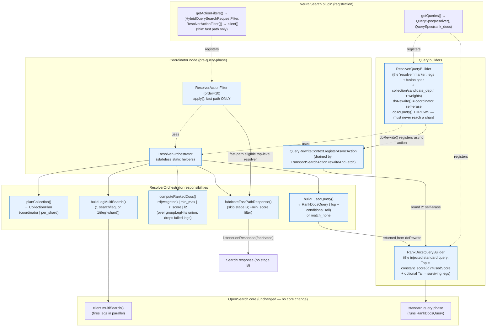
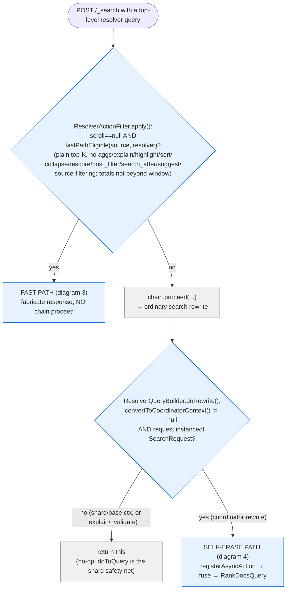
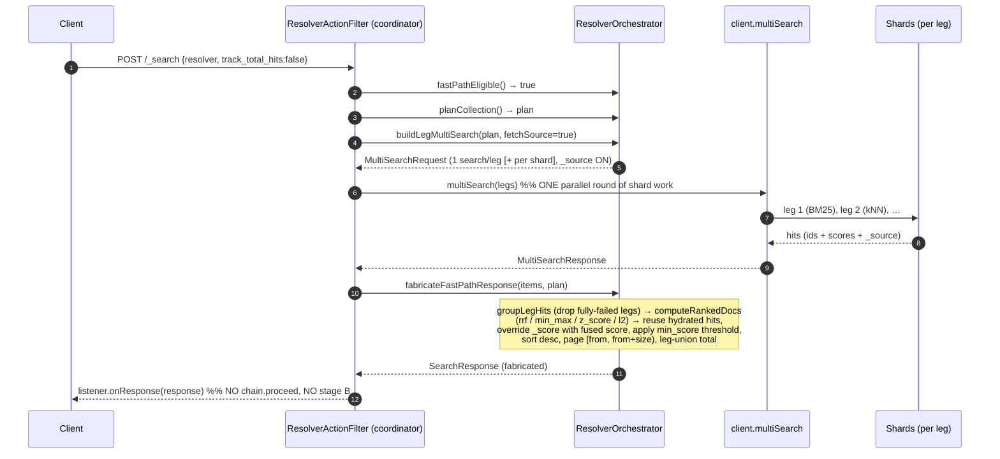
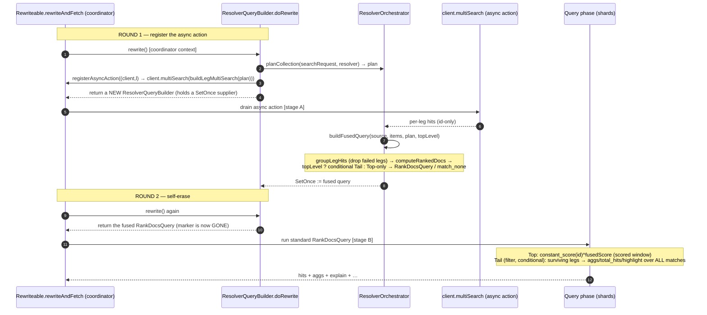
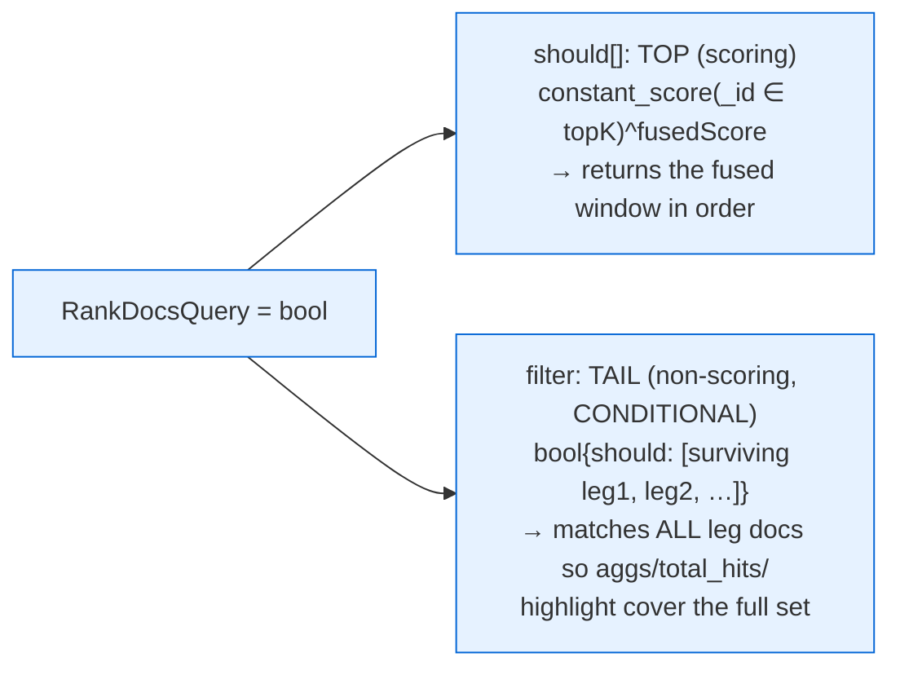
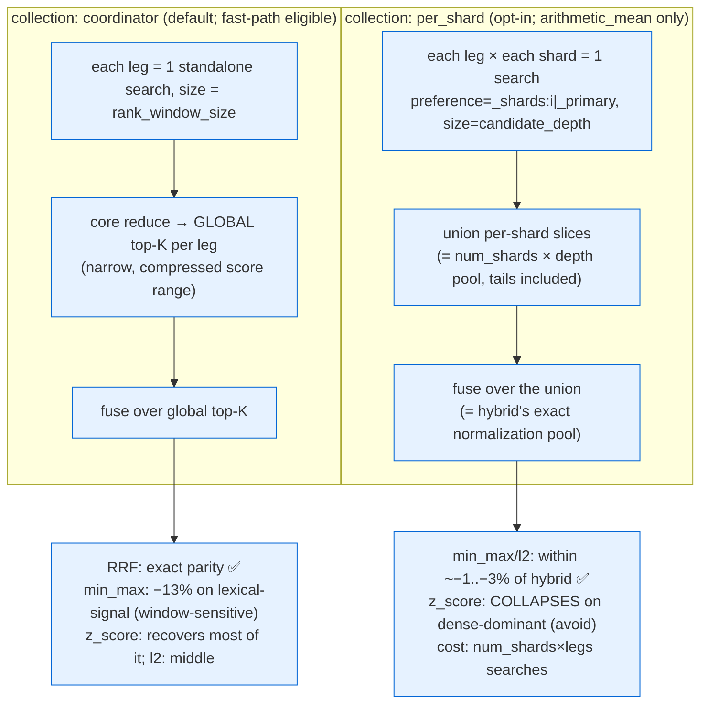

# Resolver — flow & component diagrams (v2)

Mermaid diagrams for the resolver approach, current as of **POC v2** (branch `poc/resolver-v2-adaptive-fusion`). Renders natively on GitHub. Companion to [`RESOLVER_POC.md`](RESOLVER_POC.md). Grounded in the actual code in `src/main/java/org/opensearch/neuralsearch/resolver/` — `ResolverQueryBuilder`, `ResolverActionFilter`, `ResolverOrchestrator`, `RankDocsQueryBuilder` — registered in `NeuralSearch.getQueries()` / `getActionFilters()`.

**One-line model (v2):** the resolver **self-erases at the coordinator rewrite** — `ResolverQueryBuilder.doRewrite()` fires the legs as a parallel MultiSearch via `registerAsyncAction`, fuses globally, and replaces itself with a standard `RankDocsQuery` that the ordinary search phase runs (so explain / aggs / highlight / nesting all work for free). A **thin `ResolverActionFilter`** short-circuits ONLY the stage-B-free **fast path** (fabricate the response directly for plain top-K).

> **Architecture change from v1 (the re-home).** In v1 a *global* `ActionFilter` was the sole entry point and hand-walked `bool` trees. In v2 the entry point is `doRewrite` on the query builder (the same `registerAsyncAction` pattern `NeuralQueryBuilder`/`NeuralSparseQueryBuilder` use); the ActionFilter is retained only for the fast path (a rewrite cannot fabricate a `SearchResponse`). Nesting is now **structural** (the rewrite framework recurses into any container — `bool`, `dis_max`, `function_score`, `constant_score`) and uses **fuse-then-filter** (an enclosing filter intersects the fused window at the query phase), replacing v1's bool-only tree-walk + filter push-down.

---

## 1. Component diagram — the pieces and how they relate



**Key relationships**
- **Two entry points, mutually exclusive per request:** `ResolverQueryBuilder.doRewrite` (coordinator rewrite) handles the standard / nested / per-shard paths and self-erases into a `RankDocsQuery`; the thin `ResolverActionFilter` handles ONLY the fast path (it must sit at the request/response boundary because a rewrite can return a `QueryBuilder` but never fabricate a `SearchResponse`).
- `ResolverQueryBuilder` is a **coordinator-only marker** — `doToQuery()` throws, so it must be self-erased at the coordinator and never reach a shard.
- All fusion logic lives in the **stateless `ResolverOrchestrator`** (shared by both entry points).
- The output is always a **standard query** (`RankDocsQuery`) or a **fabricated response** — never a non-standard transport type (contrast hybrid's `CompoundTopDocs`). That's why nesting/features work for free.

---

## 2. Flow — top-level dispatch (fast path vs self-erase)



Non-resolver searches: the ActionFilter does one `instanceof ResolverQueryBuilder` check and falls straight through (no tree-walk — that was v1); `doRewrite` is never entered because there's no resolver marker to rewrite. Overhead on ordinary queries is ~a single `instanceof`.

---

## 3. Flow — FAST PATH (plain top-K, beats hybrid latency)

Skips the second (stage-B) distributed search: the legs fetch `_source`, and the response is fabricated from the fused window. The ONLY path that uses the ActionFilter.



**Why it's faster than hybrid (and ES):** exactly one round of shard work (the parallel legs), no second query+fetch pass. Measured 0.58–0.88× hybrid p50, ~1.7–2× faster than ES's linear retriever, and faster than OS hybrid on heavy-kNN NQ (96 vs 144 ms). `min_score` (v2/C1) is applied here as a post-fusion threshold — it no longer forces the standard path.

---

## 4. Flow — SELF-ERASE PATH (`doRewrite`; standard / nested / per-shard / accurate-totals)

Two coordinator rewrite rounds, then the ordinary query phase runs a standard `RankDocsQuery`. No ActionFilter involved.



`RankDocsQuery` shape (unchanged from v1, but the Tail now uses only **surviving** legs — B1):



---

## 5. Flow — NESTED path (resolver inside `bool` / `dis_max` / `function_score`)

Hybrid cannot nest; the resolver can, because each marker self-erases into a standard `RankDocsQuery` **in place** during the rewrite. In v2 this is **structural** — the framework recurses `rewrite()` into every container, so each nested marker's own `doRewrite` fires independently. No bespoke tree-walk.

```mermaid
sequenceDiagram
    autonumber
    participant RA as Rewriteable.rewriteAndFetch
    participant BOOL as Container (bool/dis_max/function_score)
    participant RQB as nested ResolverQueryBuilder.doRewrite
    participant O as ResolverOrchestrator
    participant QP as Query phase

    Note over RA,BOOL: query tree contains resolver marker(s) at any depth
    RA->>BOOL: rewrite()  %% container recurses into its children
    BOOL->>RQB: child.rewrite()  %% each nested marker self-erases on its own
    RQB->>O: planCollection + registerAsyncAction(legs) [async]
    O->>O: buildFusedQuery(..., topLevel=false) → Top-only RankDocsQuery
    RQB-->>BOOL: fused RankDocsQuery (spliced in place)
    RA->>QP: run the rebuilt standard tree
    Note over QP: FUSE-THEN-FILTER: the marker fused UNFILTERED;<br/>the enclosing bool filter intersects the fused window here
```

**Fuse-then-filter (v2 semantics):** a nested marker fuses over the *unfiltered* candidate set and self-erases to a **Top-only** query; an enclosing `bool` filter then intersects the fused window at the query phase. This replaces v1's filter push-down (which pre-filtered each leg). Tradeoff: under a highly selective filter with a small `rank_window_size`, recall can be lower than push-down (the fused global leader may be filtered out) — a documented, deliberate behavioral difference. Unlocks nesting in `dis_max`/`function_score` that the v1 bool-only walk could not reach.

---

## 6. Candidate collection — coordinator vs per-shard (the relevance knob)

Where the shard→coordinator reduce happens determines the fusion pool → score-based (min_max / z_score / l2) relevance.



Guards: `planCollection` falls back to coordinator unless per_shard is requested for `arithmetic_mean` on a single concrete index with ≥2 shards, no custom routing/preference, and fan-out (num_shards × legs) ≤ 128.

---

## Legend / cross-references
- **Blue** = resolver components (new); **grey** = untouched core / pass-through.
- Prose + build/test + demo: [`RESOLVER_POC.md`](RESOLVER_POC.md). Full design + benchmarks live in the design package (`steering_documents/hybrid query/simplified_hybrid_search/`).
- Source: `src/main/java/org/opensearch/neuralsearch/resolver/` on `poc/resolver-v2-adaptive-fusion`.
