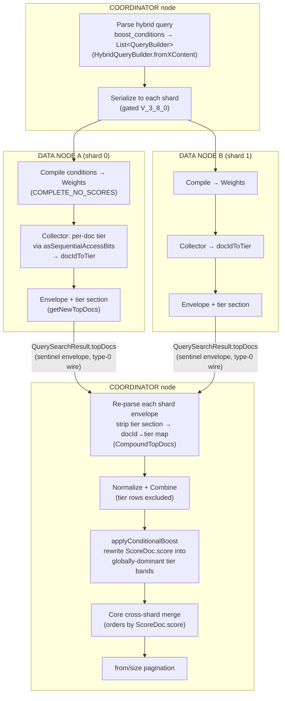
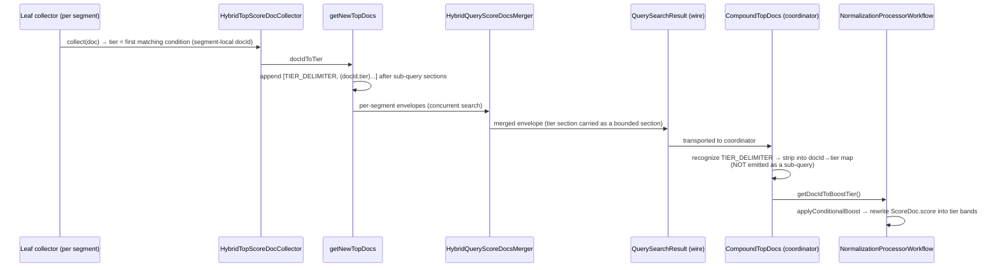

# Conditional Hybrid Result Boost — As-Built Architecture (POC)

**Status:** Implemented on branch `poc/hybrid-conditional-boost` (fork `martin-gaievski`, commits `18c53119` + `1668dd8f`). All unit tests + 300+ integration tests pass (no regression), including a 3-node multi-shard IT.
**Date:** 2026-07-16
**Supersedes:** `nike-conditional-boost-architecture.md` (pre-implementation design; single-condition `condition` shape) and the field-based shape in `nike-boost-request-examples.md` §6. This doc reflects **what was actually built**.
**Base:** `origin/main` (OpenSearch `3.8.0-SNAPSHOT`).

---

## 1. What it does

A hybrid query carries an **ordered list of boost filters** (`boost_conditions`). A document matching the first filter is promoted into the top tier band, the second filter the next band, then organic (unmatched) documents. Within a band, order is the normal hybrid combined score. The promotion:

- **keys on document-field filters, not per-document numeric fields** — the promotion rule lives in the query and changes per campaign, with zero per-document writes (this is why the field-based `merch_rank` approach was rejected);
- **is applied before pagination**, so merchandising order holds across all pages (up to `pagination_depth`);
- **works on multi-node clusters** — the tier is computed on each data node and transported to the coordinator inside the hybrid sentinel envelope (not a JVM-static map).

**Retrieval, not injection:** a document must be retrieved by at least one hybrid sub-query (within its shard's `pagination_depth`) to be eligible for boosting. The boost re-ranks retrieved candidates; it does not inject a document that no arm matched.

---

## 2. Example query

```jsonc
POST /products/_search?search_pipeline=hybrid-boost-pipeline
{
  "size": 24,
  "from": 0,
  "query": {
    "hybrid": {
      "pagination_depth": 100,
      "queries": [
        { "match": { "title": "running shoes" } },                       // lexical arm
        { "neural": { "title_embedding": { "query_text": "running shoes",
                                           "model_id": "abc123", "k": 100 } } }  // semantic arm
      ],
      "boost_conditions": [                                              // NEW — ordered tiers
        { "filter": { "term":  { "campaign_id": "SUMMER-2026" } } },     // tier 0 (top band)
        { "filter": { "terms": { "product_code": ["SKU-1","SKU-2","SKU-3"] } } },  // tier 1
        { "filter": { "bool":  { "filter": [                            // tier 2
              { "term": { "in_stock": true } },
              { "term": { "category": "featured" } }
        ] } } }
      ]
    }
  }
}
```

**Reading it:**
- Documents matching `campaign_id = SUMMER-2026` are promoted to the very top, ordered among themselves by hybrid relevance.
- Then documents matching one of the three `product_code`s (that didn't already match tier 0).
- Then in-stock featured documents.
- Then everyone else, in normal hybrid order.
- A document matching several conditions takes the **highest (earliest)** tier.

**As-built DSL notes (code-verified):**
- Field name: `boost_conditions` (`HybridQueryBuilder.java:63`), a sibling of `queries`/`pagination_depth` inside the `hybrid` object.
- Each element is a `{ "filter": <any query DSL> }` wrapper (`BOOST_CONDITION_FILTER_FIELD`, `:64`); the inner query is ordinary OpenSearch query DSL (`term`, `terms`, `bool`, `range`, …).
- Max **10** conditions (`MAX_NUMBER_OF_BOOST_CONDITIONS`, `:76`); exceeding it throws a `ParsingException`.
- Version-gated at `V_3_8_0` (`MinClusterVersionUtil.isClusterOnOrAfterMinReqVersionForBoostConditions`); on a mixed-version cluster below that, the field is ignored and the query behaves as plain hybrid.
- **Grouping guidance:** 100+ promo items should map to a *handful* of grouped filters (one `terms` with many values, or a few campaign predicates) — cost scales with the number of *filters*, not items. One-filter-per-SKU is the anti-pattern (it re-introduces per-item management).

**A search pipeline with a fusion processor is still required** (RRF or normalization) — the boost runs inside that phase-results step. Example RRF pipeline:

```jsonc
PUT /_search/pipeline/hybrid-boost-pipeline
{
  "phase_results_processors": [
    { "score-ranker-processor": { "combination": { "technique": "rrf", "rank_constant": 60 } } }
  ]
}
```

---

## 2b. Boosting specific documents by `_id`

Because each condition's `filter` is **arbitrary OpenSearch query DSL**, boosting a hand-picked set of documents by `_id` works **today with zero extra code** — just use an `ids` filter (code-verified: `ids` is a standard `QueryBuilder`, parsed via `parseInnerQueryBuilder` at `HybridQueryBuilder.java:548`, compiled to a Weight and matched per-document in the collector exactly like any other filter).

**Promote a set of `_id`s (one tier — all listed ids share the top band):**

```jsonc
POST /products/_search?search_pipeline=hybrid-boost-pipeline
{
  "query": {
    "hybrid": {
      "pagination_depth": 100,
      "queries": [
        { "match":  { "title": "running shoes" } },
        { "neural": { "title_embedding": { "query_text": "running shoes", "model_id": "abc123", "k": 100 } } }
      ],
      "boost_conditions": [
        { "filter": { "ids": { "values": ["SKU-6", "SKU-3", "SKU-9"] } } }
      ]
    }
  }
}
```
→ `SKU-6`, `SKU-3`, `SKU-9` are promoted to the top band (ordered among themselves by hybrid relevance); everything else stays organic.

**Strict per-`_id` order (each id its own tier):** put each id in its own condition — earlier = higher.

```jsonc
"boost_conditions": [
  { "filter": { "ids": { "values": ["SKU-6"] } } },   // rank 1
  { "filter": { "ids": { "values": ["SKU-3"] } } },   // rank 2
  { "filter": { "ids": { "values": ["SKU-9"] } } }    // rank 3
]
```
(bounded by `MAX_NUMBER_OF_BOOST_CONDITIONS` = 10).

**You can mix `ids` with attribute filters** — e.g. tier 0 = a curated `ids` list, tier 1 = `campaign_id`, tier 2 = `in_stock` — since every condition is just a filter.

**Two limits to know (same as any boost condition):**
- **Retrieval, not injection.** An `_id` is promoted only if it was retrieved by at least one hybrid sub-query within its shard's `pagination_depth`. An `_id` that matches neither arm (or ranks below `pagination_depth` on its shard) is *not* pulled into results. This differs from a post-fetch doc-id reranker (e.g. RFC #1689's `ext.result_boost`) that can inject any id regardless of retrieval.
- **No per-id numeric factor.** Today conditions carry an ordinal *tier*, not a `2.0`/`3.0` multiplier — relative priority is expressed by *order*, not magnitude. Per-id/per-condition weighted factors are a possible future extension (a deliberate semantic change, since multiplicative factors don't guarantee ordering the way tier bands do).

---

## 3. Architecture — where each step runs



**The critical property (why bands, not a per-shard reorder):** OpenSearch's cross-shard merge (`SearchPhaseController` → `TopDocs.merge` → `ScoreMergeSortQueue`) orders **purely by `ScoreDoc.score`**. A per-shard list reorder that doesn't rewrite `.score` is a *silent no-op on multi-shard* (it would pass single-node tests and fail in production). So `applyConditionalBoost` encodes the tier into `.score`:

```
band          = globalMaxCombinedScore + 1
boosted score = combinedScore + (numConditions - tier) * band
```

This makes tier 0 strictly outscore tier 1, which strictly outscores organic — **across all shards** — while preserving combined-score order within each band.

---

## 4. The multi-node transport (the hard part)

The tier is computed on the **data node** (only place the shard's `LeafReaderContext`/DocValues and the compiled filter `Weight` exist) but consumed on the **coordinator**. The first POC used a JVM-static registry, which only works single-node (the reverted PR #1369 failure class). The as-built transport rides the **existing hybrid sentinel envelope**.

### Envelope layout (per shard, on the type-0 `doc+score` wire)

```
[ START_STOP ]
[ DELIMITER ] [ subquery-0 hits... ]        ← real sub-query sections (unchanged)
[ DELIMITER ] [ subquery-1 hits... ]
[ TIER_DELIMITER ] [ (docId, tier) rows ]   ← NEW boost tier section
[ START_STOP ]
```

- A **third magic number** `MAGIC_NUMBER_TIER_DELIMITER` marks the tier section (`HybridSearchResultFormatUtil`). Each tier row is a plain `ScoreDoc(matchedDocId, tierAsFloat)` — no `ScoreDoc` subclass, so it survives the type-0 wire (which rejects subclasses).
- It's added to `isHybridQuerySpecialElement`, so the **concurrent-segment merger** (`HybridQueryScoreDocsMerger`) — a count-agnostic section walk — carries it through with **zero merger changes**.
- The section is emitted whenever boost conditions are configured (even with **zero** matched rows), so per-segment envelopes stay structurally symmetric and the merger's section lockstep holds.



**Rolling upgrade:** the tier section is only emitted when conditions were serialized to the data node, which is gated on cluster-min `V_3_8_0`. During a rolling upgrade the whole feature stays dormant until every node is upgraded, so no old coordinator ever receives an envelope shape it can't parse. Reverse (new coordinator, old data node) yields an empty tier map → organic order, no error.

---

## 5. Components changed (as-built)

| Component | Change |
|---|---|
| `HybridQueryBuilder` | Parse/serialize/rewrite `boost_conditions` (ordered `{filter}` list); `MAX_NUMBER_OF_BOOST_CONDITIONS=10`; `V_3_8_0` gate; compile conditions in `doToQuery` onto `HybridQueryContext`. |
| `HybridQueryContext` | Carries the compiled `List<Query>` boost conditions. |
| `MinClusterVersionUtil` | `V_3_8_0` constant + `isClusterOnOrAfterMinReqVersionForBoostConditions()`. |
| `HybridCollectorManager` | Builds one `COMPLETE_NO_SCORES` Weight per condition (where the searcher exists); passes to the collector. |
| `HybridTopScoreDocCollector` | Per-doc tier via `Lucene.asSequentialAccessBits` (core `FilteredCollector` primitive), segment-local docId keyed by `doc+docBase`; `getDocIdToTier()`, `hasBoostConditions()`. |
| `HybridSearchResultFormatUtil` | `MAGIC_NUMBER_TIER_DELIMITER` + `createTierDelimiterElement…` + `isHybridQueryTierDelimiterElement`; added to `isHybridQuerySpecialElement`. |
| `HybridSearchCollectorResultUtil` | `getNewTopDocs` appends the tier section (symmetric emission). |
| `CompoundTopDocs` | Re-parse recognizes the tier delimiter, strips it into `getDocIdToBoostTier()`; tier rows never become a sub-query TopDocs. |
| `NormalizationProcessorWorkflow` | `applyConditionalBoost` after combine / before pagination; band-rewrite into `ScoreDoc.score`; `numConditions` derived from max observed tier. |
| *(deleted)* `HybridBoostTierRegistry` | The single-node JVM-static map, removed. |

**Tests:** `HybridConditionalBoostCollectorTests` (shard-side tier), `HybridConditionalBoostWorkflowTests` (band-rewrite), `HybridBoostTierEnvelopeTests` (envelope round-trip), `HybridQueryBuilderTests` (parse/wire/cap), `HybridConditionalBoostIT` (3-node multi-shard, `-PnumNodes=3`) with two cases: `…RemoteShard_thenPromotedToTop` (the transport centerpiece — fails with the old registry, passes with the envelope) and `…TargetBelowPageOne_thenPromotedOntoPageOne` (pagination — a boost-matching doc that naturally sorts below a size-1 page 1 is promoted to rank 0, plus a size=3 page-1/page-2 leg). Both green on `-PnumNodes=3` (JUnit XML: `tests="2" failures="0" errors="0"`).

---

## 6. Known scope / deferred (POC)

- **Sort & collapse paths:** boost applies only on the default score-ranked path. Under explicit `sort` or `collapse` (which order by `FieldDoc` sort keys, not `_score`) the score-band boost is a silent no-op. v1 targets score-sorted hybrid (Nike's case); type-1/type-2 envelope encodings are follow-up.
- **`explain`:** the boost is not yet reflected in `hybrid_score_explanation`.
- **`min_score`:** it filters combined scores *before* the boost slot, so a condition-matching but sub-`min_score` doc can't be promoted.
- **Within-tier ordering** is the hybrid combined score (best-relevance-first); no secondary key.
